# Project 3: Weak RDP Exposure and Brute-Force Authentication Against a Domain Controller

## Overview

In this lab, I created an intentionally weak remote access path to a domain controller by exposing RDP and assigning a weak domain user the rights needed to authenticate remotely.

From the attacker side, I validated that TCP port 3389 was reachable, confirmed that RDP was exposed, and used Hydra from a Kali Linux machine to test the weak account against the service.

This phase was designed not only to demonstrate weak credential abuse, but also to generate authentication activity that could later be reviewed in Security Onion and Elastic. The scenario shows how exposed remote access, weak passwords, and overly permissive logon rights can combine into a viable initial access path in an Active Directory environment.

---

## Lab Environment

### Systems
- Kali Linux attacker VM
- Windows Server 2022 Domain Controller
- Security Onion

### Tools Used
- Nmap
- Hydra
- Windows Group Policy Management
- Remote Desktop settings

---

## Objective

Build and validate an intentionally weak RDP-based access path to the domain controller in order to simulate realistic authentication abuse and produce telemetry for later detection and investigation.

This phase focused on:

- establishing an exposed RDP service on the domain controller
- creating a deliberately weak domain account for authentication testing
- assigning the rights required to make remote logon possible
- validating service reachability from the attacker system
- generating brute-force-style authentication activity for later review

---

## Configuration Changes

To prepare the domain controller for the simulation, I made a series of configuration changes to support remote authentication and controlled password-guessing activity.

These changes included:

- confirming Remote Desktop was enabled
- creating a weak domain user named `sally` with the password `password`
- adding `sally` to the Remote Desktop Users group
- updating Group Policy so the relevant users and groups could:
  - log on through Remote Desktop Services
  - log on locally
- adding `sally` to:
  - `IT Admins`
  - `Administrators`
- enforcing the Default Domain Policy
- running `gpupdate /force` to apply the changes

Together, these changes established an intentionally weak but controlled remote-access path that could be used to simulate password-guessing activity against the domain controller and later analyze the resulting telemetry from the defender side.

---

## Attacker Validation

Before attempting authentication abuse, I re-ran Nmap from the Kali system to confirm that the target service was reachable and exposed as expected.

The scan showed:

- `3389/tcp open`
- `ms-wbt-server`
- Microsoft Terminal Services information associated with the domain controller

This confirmed that the Remote Desktop service was accessible from the attacker system and that the path was ready for credential testing. Validating service exposure first helped separate reachability issues from authentication issues before moving into password attacks.

---

## Password Attack Simulation

After confirming RDP exposure, I prepared the `rockyou.txt` wordlist on Kali and used Hydra to test credentials against the domain controller’s RDP service.

### Successful weak account validation

I first targeted the intentionally weak domain user `sally` to verify that the exposed RDP service was susceptible to credential guessing under poor password hygiene.

Hydra successfully validated that the weak account credentials were guessable through the exposed RDP service, confirming that the combination of exposed remote access, weak password selection, and assigned logon rights created a viable authentication abuse path.

### Noisy administrator brute-force attempt

I then launched a second, noisier Hydra attempt against the `administrator` account.

This phase was not intended to demonstrate compromise. Its purpose was to generate repeated failed authentication attempts that could later be examined from the defender side as brute-force-style activity.

---

## Key Takeaways

- Exposed RDP significantly increases the attack surface of a domain controller
- Weak passwords can turn remote access exposure into a practical initial access path
- Group membership and logon rights matter just as much as account creation
- Attacker-side validation should confirm both service exposure and credential weakness
- Authentication abuse creates investigation opportunities even when compromise does not occur
- Initial access simulations become more valuable when they are tied to downstream logging, alerting, and triage workflows

---

## Screenshots

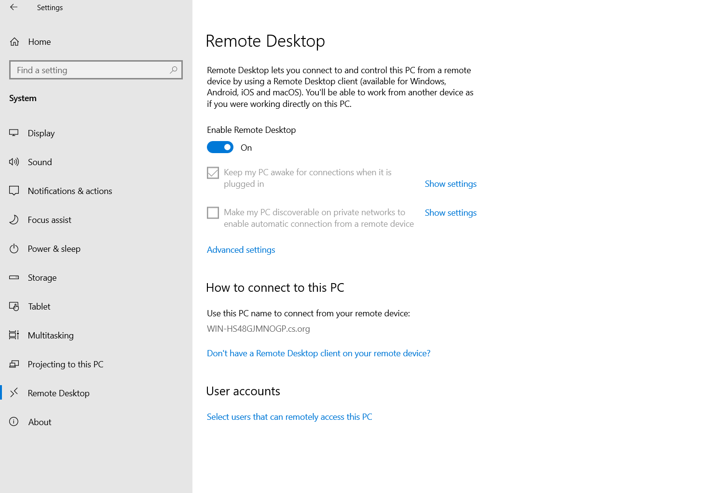
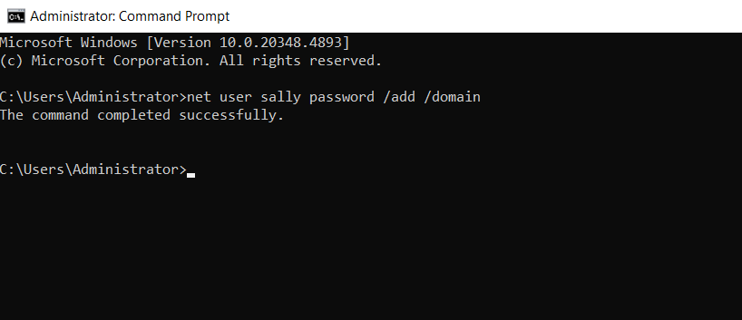
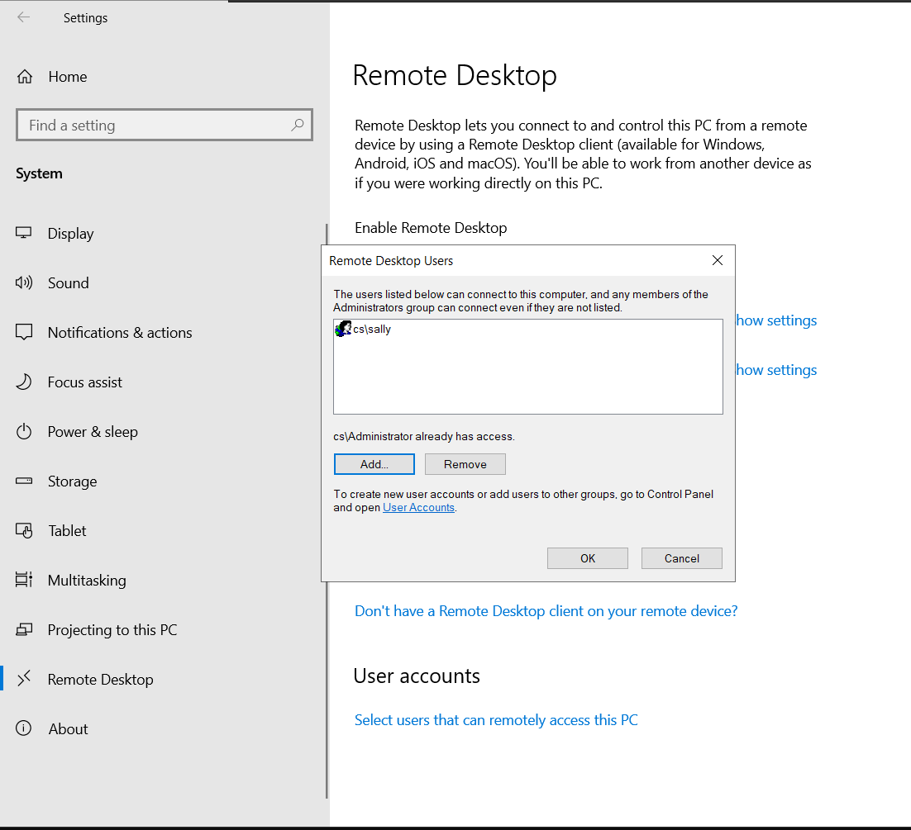
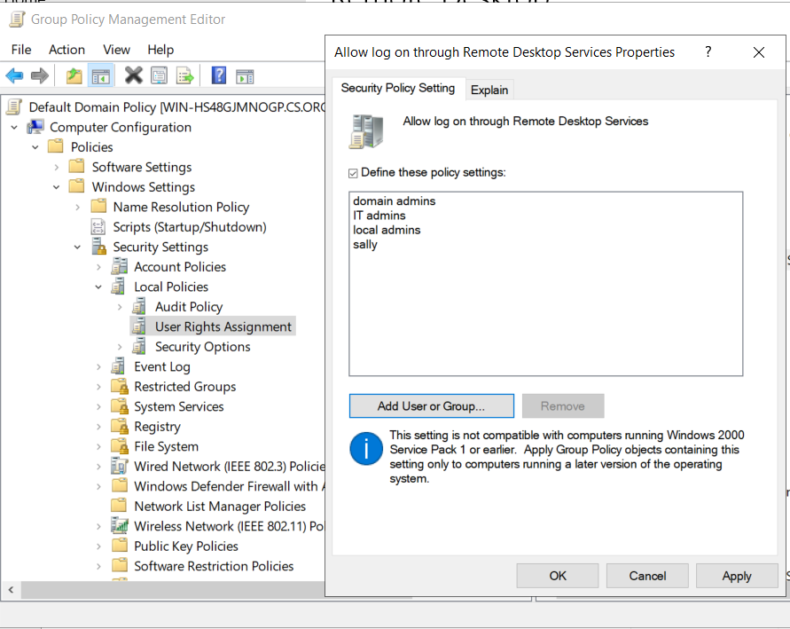
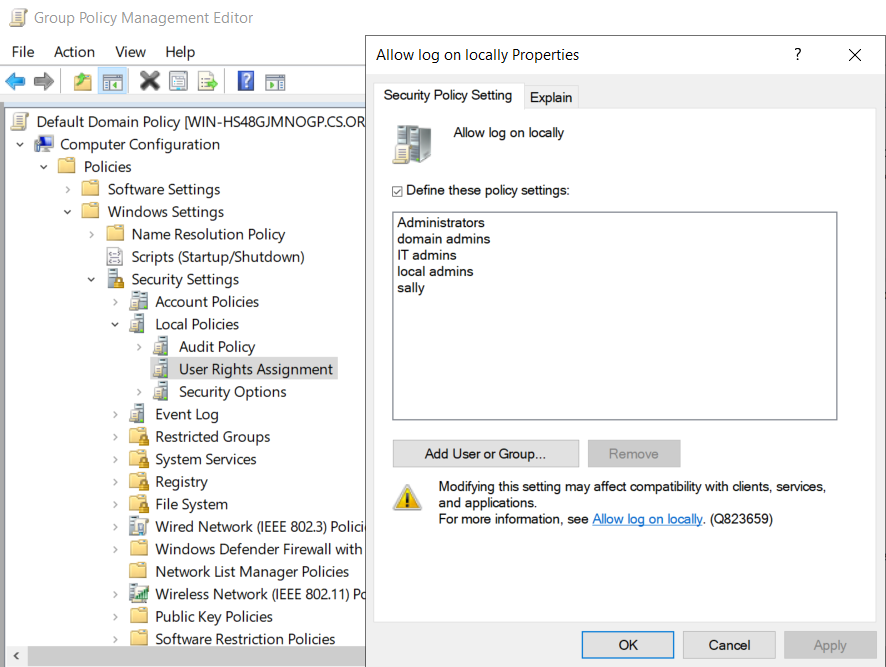
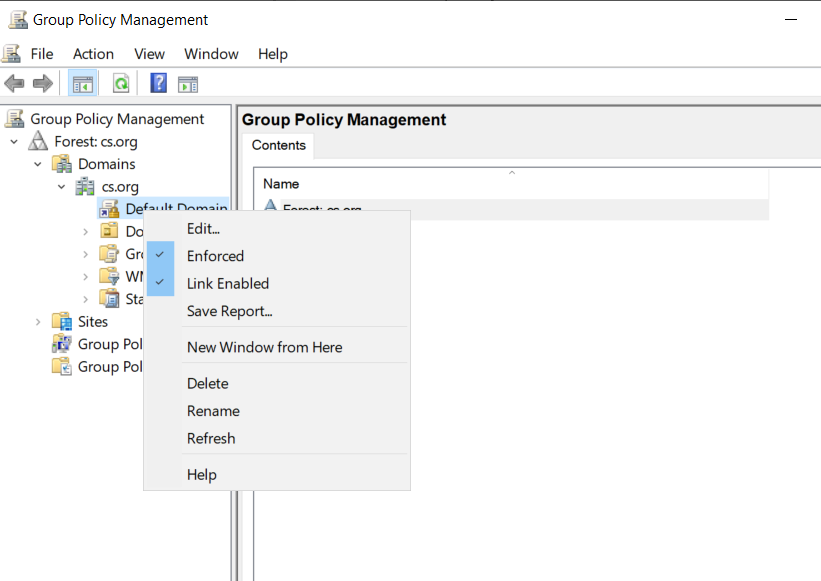
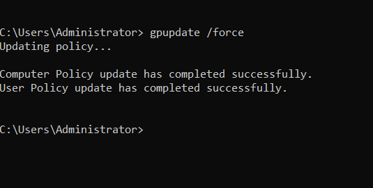
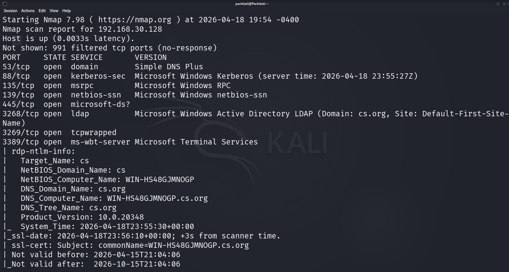
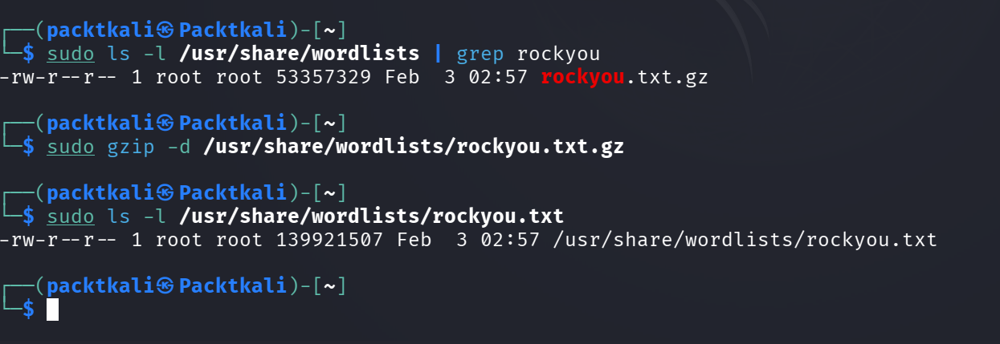
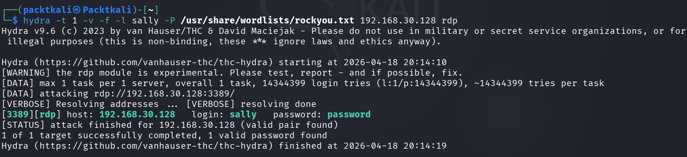
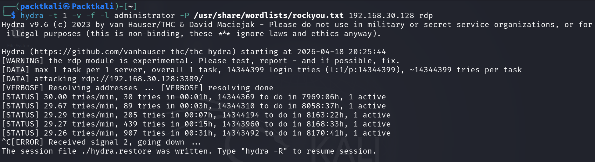

---

## Conclusion

This phase demonstrated how exposed RDP, weak credential hygiene, and overly permissive logon configuration can combine into a realistic authentication abuse scenario against a domain controller.

More importantly, it created a controlled set of authentication events that can now be reviewed from the defender side in Security Onion and Elastic. The next phase will focus on analyzing the resulting logs and alerts to study failed logons, source attribution, authentication patterns, and brute-force detection opportunities.